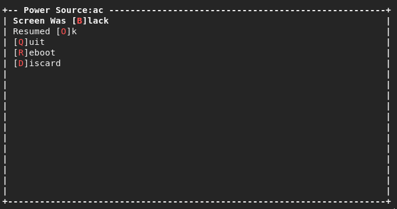

Over Engineered Boot Logging.
==

Over engineering things can be fun :)

Note:  Currently this is probably only useful to me, and no effort has been made to make it production ready.

Collecting info about bugs that can crash the computer or make the screen black can be painful.

This was made to make make it easier to collect logs for this issue:
https://gitlab.freedesktop.org/drm/amd/-/issues/2449

Since the screen could go black with sometimes responsive keyboard it makes it necessary
to collect info before a possible reboot, then finish collecting information afterwards.

Requirements:
    amd_s2idle.py:  location specified in config.py

The process is split into two parts:

Setting up test scenarios

`$ python new_test.py power`

This sets up pending tests to run using the "power" template (currently the only template)

templates specify a set of scenarios (data to collect), and also a set of "quick responses".
quick responses are used to populate a menu, so the user can record the result of the test,
either immediately or after a reboot.

Running a test scenario

`$ python run_test.py`

This script either runs a test and lets the user record a result or run an action.
If a test is waiting for a result it will prompt the to record the result or run an action.

Actions:

`quick-responses.csv` contains a list of actions that can be run after a test.

To make more than one action run on a keypress, repeat the description in the csv file
specifying each action.

Actions may be toggled by data in the test context, for example the `power` template will
reboot the computer after recording the result, but only if it's recording a result
for this boot (rebooting while recording an old result would not be useful).
